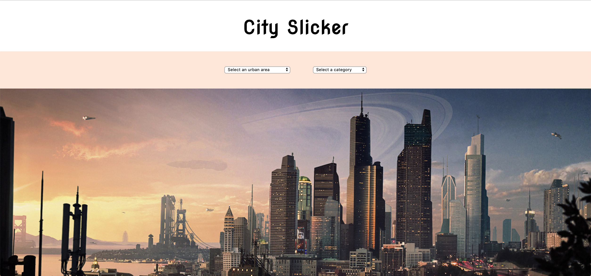
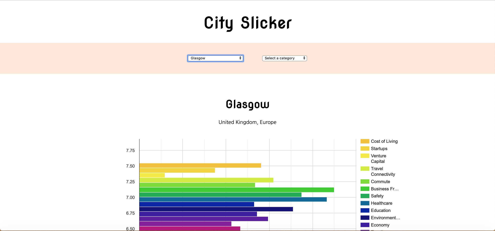
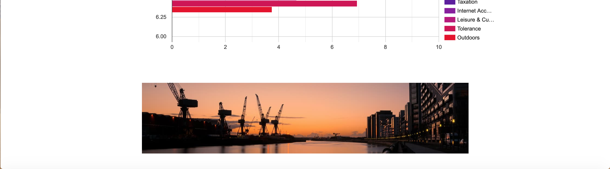

# City Slicker
**Individual Project**

## The Project
City Slicker is a JavaScript Vue application using an [external API](https://developers.teleport.org/api/reference/) and Google Charts to visually display statistics comparing quality of life data of 266 cities worldwide, helping people find cities that best match their needs.

The app provides a drop-down list of all cities and  a drop-down list of each category. Users can either select a city to retrieve all data on that specific city, or they can select a category and view the top ten cities with the highest scores for that category.

[Project Brief](https://gist.github.com/futuresocks/031986766572aaecdbaffc17adf495f8)

## Screen grabs






## Build Setup

``` bash
# install dependencies
npm install

# serve with hot reload at localhost:8080
npm run dev

# build for production with minification
npm run build
```

For detailed explanation on how things work, consult the [docs for vue-loader](http://vuejs.github.io/vue-loader).
